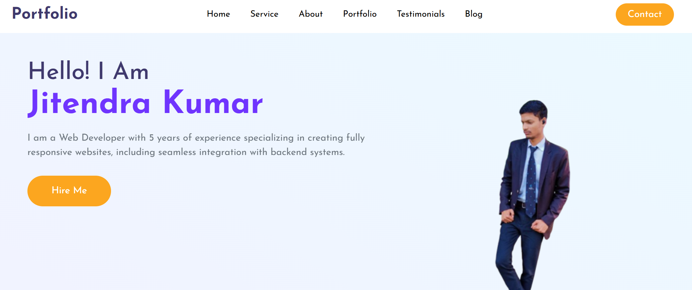

# Personal Portfolio Website

A modern, responsive personal portfolio website built using **HTML**, **CSS**, and **JavaScript**. This project showcases your skills, projects, and experience while providing a platform to highlight your work and connect with visitors.

## 🔗 Live Demo

[Click here to view the live demo](https://technical-jitendra-kumar.github.io/Personal_portfolio/)

---

## 📂 Features

- **Responsive Design**: Fully functional on all screen sizes, from desktops to mobile devices.
- **Interactive UI/UX**: Engaging animations and smooth transitions enhance user experience.
- **Project Showcase**: Displays detailed information about your projects with links to repositories or live demos.
- **About Section**: Highlights your skills, education, and experience.
- **Contact Form**: Enables visitors to reach out via email.
- **Social Media Links**: Directs visitors to your professional profiles (e.g., LinkedIn, GitHub).

---

## 🛠️ Technologies Used

- **HTML**: For creating the structure of the website.
- **CSS**: For styling and layout design.
- **JavaScript**: For adding interactivity and dynamic content.

---

## 🚀 How to Use

1. Clone the repository:
   ```bash
   git clone https://github.com/technical-jitendra-kumar/Personal_portfolio.git
   ```
2. Navigate to the project directory:
   ```bash
   cd portfolio-website
   ```
3. Open the `index.html` file in your preferred web browser.

---

## ✨ Customization

You can personalize this portfolio to match your branding and details:
- Update the `index.html` file with your name, bio, and professional information.
- Replace placeholder project links with your own.
- Modify the `style.css` file to customize colors, fonts, or layout.

---

## 🌟 Screenshots
 ### Homepage

### Project Showcase


---

## 📧 Contact

For any inquiries, feel free to reach out via email or connect on LinkedIn:  
- **Email**: jitendrakumarjjk10@gmail.com  
- **LinkedIn**: [linkedin.com/in/your-profile](https://github.com/technical-jitendra-kumar)  
